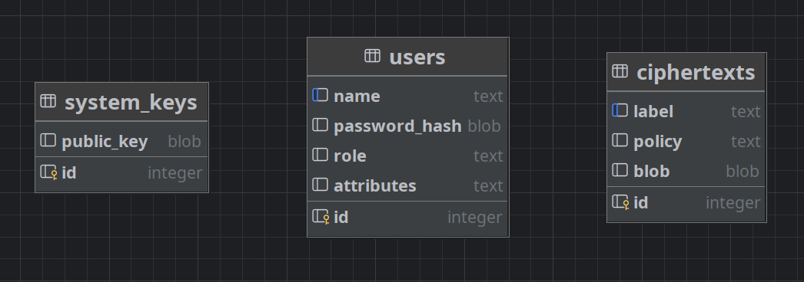

# System udostępniania danych z kontrolą dostępu opartą na kryptografii atrybutowej (ABE)

Celem projektu jest stworzenie systemu, który pozwala użytkownikom udostępniać zaszyfrowane dane (np. pliki, raporty, dane osobowe), 
ale tylko tym odbiorcom, którzy spełniają określone warunki — zamiast konkretnych kluczy, dostęp przyznawany jest na podstawie atrybutów (rola, dział, poziom uprawnień). 

## Zakres funkcjonalny: 

- Generowanie kluczy dla użytkowników z zestawem atrybutów (np. "student", "admin"). 
- Szyfrowanie danych wg polityki dostępu (np. "HR", "MANAGER"). 
- Odszyfrowanie tylko wtedy, gdy klucz użytkownika spełnia politykę. 
- Tworzenie oraz usuwanie użytkowników.
- Modyfikacja atrybutów użytkowników.
- Prosty interfejs CLI do testowania różnych scenariuszy dostępu.

## Wykorzystana technologia: 
Ciphertext-Policy Attribute-Based Encryption (CP-ABE), dokładnie Bethencourt-Sahai-Waters (BSW07) przy użyciu biblioteki `Charm-Crypto`. 

## Uruchomienie projektu w Dockerze
Aby uruchomić projekt w środowisku Docker, wykonaj poniższe kroki:

### Wymagania wstępne
- Uruchomiony demon Docker,
- Sklonowane repozytorium projektu z pliktem `Dockerfile` w katalogu głównym.

### Budowanie i uruchamianie projektu

```
docker build -t charm-crypto .
docker run -it --rm -v $(pwd)/output:/app/output -v $(pwd)/data:/app/data charm-crypto
```

### Testowanie projektu

```
docker run --rm charm-crypto python tests.py
```

## Przykład zastosowania: 

Domyślne konto administratora tworzone podczas uruchamiania projektu: 

- Nazwa użytkownika: `admin`
- Hasło: `admin123`

Administrator ma pełne uprawnienia do zarządzania użytkownikami i plikami, a zwykli użytkownicy mogą jedynie dodawać i odszyfrowywać pliki zgodnie z ich atrybutami.

### Logowanie do interfejsu CLI

```
=== System ABE ===
1. Logowanie
0. Wyjście
> 1
=== Logowanie ===
Nazwa użytkownika: admin
Hasło: 
Podaj ścieżkę do pliku z kluczem użytkownika (lub 'anuluj' by przerwać): output/admin.key
[✓] Klucz zaimportowany.
[✓] Zalogowano jako admin (admin)
```

Dostępne opcje dla administratora:

```
=== MENU ADMINA ===
1. Dodaj użytkownika
2. Usuń użytkownika
3. Lista użytkowników
4. Zaktualizuj atrybuty użytkownika
5. Dodaj plik (zaszyfruj)
6. Odszyfruj plik
7. Usuń plik
8. Lista zaszyfrowanych plików
9. Eksportuj swój klucz
0. Wyloguj
```

Dostępne opcje dla zwykłego użytkownika:

```
=== MENU UŻYTKOWNIKA ===
1. Dodaj plik (zaszyfruj)
2. Odszyfruj plik
3. Eksportuj swój klucz
4. Lista zaszyfrowanych plików
0. Wyloguj
```

### Tworzenie użytkownika i generowanie klucza

Operacja tworzenia użytkownika jest dostępna **tylko dla administratora**.
Przy rejestracji nowego użytkownika nazwa użytkownika, oraz hasło poddawane są podstawowej walidacji.

Nazwa użytkownika:
- musi mieć co najmniej 3 znaki,
- nie może zawierać znaków specjalnych (dopuszczalne tylko litery i cyfry).

Hasło:
- musi mieć co najmniej 6 znaków,
- musi zawierać co najmniej jedną cyfrę.

Przykład:

```
=== Rejestracja użytkownika ===
Nazwa użytkownika: basicuser
Hasło: 
Potwierdź hasło: 
Rola (admin/user): user
Atrybuty (np. HR,MANAGER): HR
[✓] Użytkownik zarejestrowany.
[INFO] Wygenerowano klucz atrybutowy dla nowego użytkownika.
Podaj ścieżkę do zapisu klucza użytkownika (np. output/user.key): output/basicuser.key
[✓] Klucz wyeksportowany do output/basicuser.key
[✓] Klucz zapisany do output/basicuser.key. Przekaż go użytkownikowi.
```

Listę wszystkich użytkowników może wyświetlić **tylko administrator**. Format wyświetlania: `nazwa użytkownika | rola | atrybuty`

Przykład:

```
Użytkownicy:
 - admin | rola: admin | atrybuty: ADMIN,HR,MANAGER,DEVELOPER,ARCHITECT,STUDENT,INTERN,LAWYER,ACCOUNTANT
 - basicuser | rola: user | atrybuty: HR
```

### Modyfikacja atrybutów użytkownika

Operacja modyfikacji atrybutów użytkownika jest dostępna **tylko dla administratora**. Pozwala na dodawanie lub usuwanie atrybutów z istniejącego użytkownika.

Przykład:

```
Nazwa użytkownika: basicuser
Aktualne atrybuty: ['HR']
Wybierz akcję:
1. Dodaj
2. Usuń
3. Cofnij
> 1
Atrybuty do dodania (oddzielone przecinkiem): MANAGER
[✓] Atrybuty dodane. Nowe atrybuty: ['HR', 'MANAGER']
```

### Usuwanie użytkownika

Operacja usunięcia użytkownika jest dostępna **tylko dla administratora**.

- Dane o użytkowniku są usuwane z bazy danych. 
- Wyeksportowany klucz użytkownika nie jest usuwany, ale nie będzie już akceptowany przez system.

Przykład:

```
=== Usuwanie użytkownika ===
Podaj nazwę użytkownika do usunięcia: basicuser
Czy na pewno chcesz usunąć użytkownika 'basicuser'? (tak/nie): tak
[✓] Użytkownik 'basicuser' został usunięty.
```

### Szyfrowanie pliku

- Wskazany plik jest szyfrowany przy użyciu polityki dostępu, która jest zgodna z atrybutami użytkownika.
- Zaszyfrowany plik jest zapisywany w odpowieniej tabeli bazy danych.

Przykład:

```
=== Dodawanie pliku ===
Ścieżka do pliku: TODO.txt
Etykieta: FILE-1   
Polityka dostępu (np. HR or MANAGER): HR
[✓] Plik 'TODO.txt' zaszyfrowany i dodany jako 'FILE-1'.
```

Listę wszystkich zaszyfrowanych plików może wyświetlić **każdy użytkownik**, bez względu na atrybuty jakie posiada. Format wyświetlania: `etykieta | polityka dostępu`

Przykład:

```
Zaszyfrowane pliki:
 - FILE-1 | polityka: HR
 - FILE-2 | polityka: MANAGER
```

### Odszyfrowanie pliku

Aby odszyfrować plik, **użytkownik musi posiadać odpowiedni klucz z atrybutami**, które pasują do polityki dostępu pliku.

Przykład (użytkownik `basicuser` z atrybutem `HR`):

```
Etykieta pliku do odszyfrowania: FILE-1
Ścieżka do zapisu odszyfrowanego pliku (np. output/data.txt): output/file-1.txt        
[✓] Plik odszyfrowany i zapisany.
```

W przypadku, gdy użytkownik nie ma odpowiednich atrybutów do odszyfrowania pliku:

```
Etykieta pliku do odszyfrowania: FILE-2
Ścieżka do zapisu odszyfrowanego pliku (np. output/data.txt): output/file-2.txt
invalid return output for 'decrypt'
[!] Błąd odszyfrowania: Brak dostępu: nie można odszyfrować klucza sesji.
```

### Usuwanie pliku

Operacja usunięcia pliku jest dostępna **tylko dla administratora**. Z bazy danych usuwany jest szyfrogram pliku.

Przykład:

```
=== Usuwanie zaszyfrowanego pliku ===
Podaj etykietę pliku do usunięcia: FILE-2
[✓] Plik o etykiecie 'FILE-2' został usunięty.
```
## Szyfrowanie plików
* Wygenerowanie losowego elementu z grupy $G_T$
* Utworzenie skrótu od utworzonego elementu za pomocą `sha256` i wykorzystanie go jako klucz symetryczny
* Zaszyfrowanie pliku algorytmem AES
* Zaszyfrowanie klucza symetrycznego algorytmem CP-ABE
* Zapis obu elementów w bazie danych

## Deszyfrowanie plików
* Odczyt z bazy dancyh zaszyfrowanego klucza AES i pliku
* Odszyfrowanie klucza symetrycznego za pomocą klucza publicznego oraz klucza atrybutowego użytkownika
* Utworzenie skrótu od odtworzonego klucza AES za pomocą `sha256`
* Odszyfrowanie pliku uzyskanym kluczem symetrycznym

## Baza danych
Aplikacja wykorzystuje `SQLite`. Schemat bazy danych:



#### system_keys
* public_key : klucz publiczny do szyfrowania i odszyfrowania plików

#### users
* name : unikalna nazwa użytkownika
* password_hash : skrót hasła wygenerowany przy pomocy algorytmu bcrypt
* role : rola użytkownika w systemie - `admin` lub `user`
* attributes : lista atrybutów użytkownika oddzielonych przecinkami

#### ciphertexts
* label : etykieta pliku
* policy : polityka dostępu `charm` - atrybuty połączone operatorami `and` i `or`
* blob: zaszyfrowana zawartość pliku wraz z zaszyfrowanym kluczem symetrycznym do odczytu